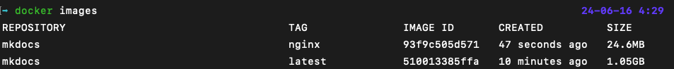

For this exercise I have created a simple MkDocs project. Then I dockerize the project. After testing with the base image I created a multi-stage, much simpler docker image based on Nginx image.

Project can be reached at [https://github.com/BugraK/example-mkdocs](https://github.com/BugraK/example-mkdocs)

You can see the before and after:

