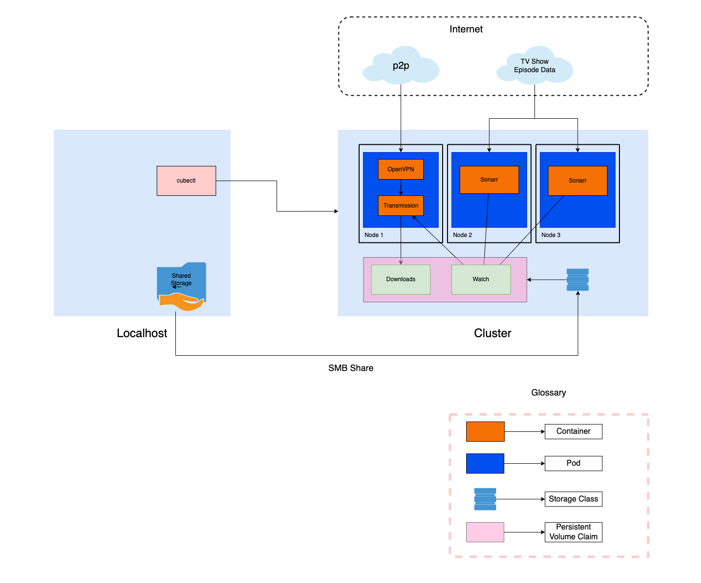

The cluster controlled from local computer. A folder is shared with cluster through SMB protocol.

Cluster contains 3 nodes. Every node has 1 pod in it. First pod contains 2 containers. OpenVPN container connects the internet and Transmission container uses OpenVPN's network. Pod 2 and 3 has Sonarr containers. They fetch the new episode data for TV shows and download required torrent file into Watch folder. Transmission gets the file from Watch folder and downloads new episodes into Downloads folder.

This Kubernetes setup ensures fetching of new episode data in the case of failure of Node 2 or Node 3.

